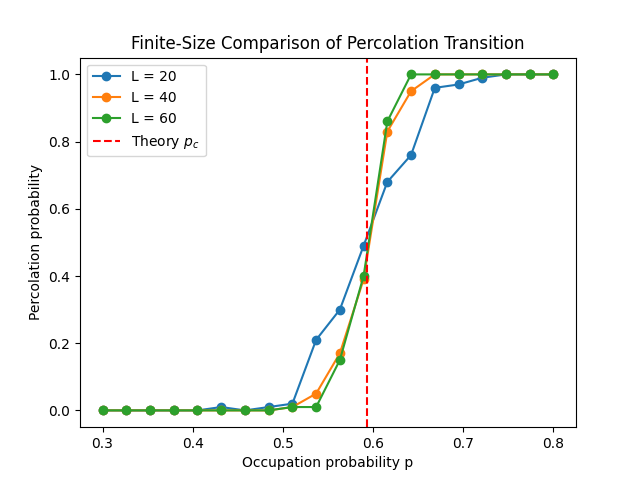
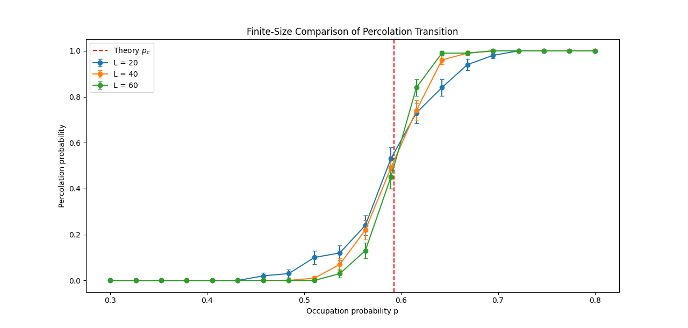
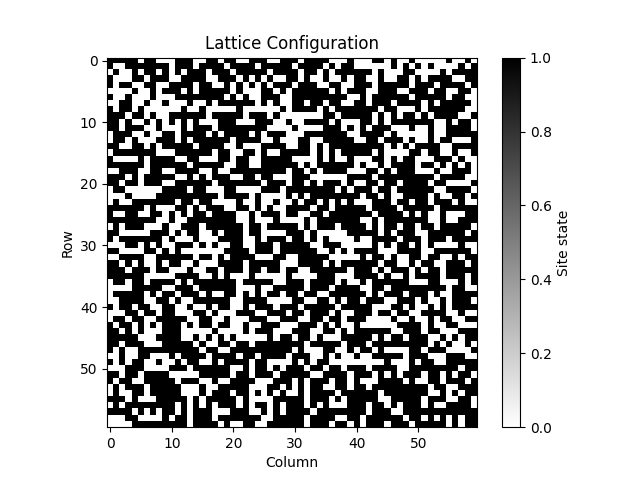

# Monte Carlo Simulation of 2D Site Percolation on a Square Lattice

---

# Introduction

## Overview

This project implements a **Monte Carlo simulation of site percolation on a two-dimensional square lattice**.

In percolation theory, we study how **connectivity emerges in a random system**. In this model, each site of a square grid (lattice) is occupied with probability **p** and empty otherwise.

As the probability **p** increases, occupied sites begin forming connected clusters. When a cluster connects the **top and bottom boundaries of the lattice**, the system is said to **percolate**.

At small values of p, clusters remain small and disconnected. As p increases, clusters grow until a critical point is reached where a spanning cluster appears across the system. This critical probability is known as the **percolation threshold**.

For a two-dimensional square lattice, the theoretical threshold is approximately

p_c ≈ 0.5927

This project estimates the threshold numerically using **Monte Carlo simulations**. Random lattices are generated repeatedly and a **breadth-first search (BFS)** algorithm is used to detect whether a spanning cluster exists.

The simulation also investigates:

- how the probability of percolation changes with p  
- how lattice size affects the transition (finite-size effects)  
- statistical fluctuations from repeated simulations

The results are visualized through plots of percolation probability versus occupation probability.

---

## Project Structure

```text
Monte-Carlo-Simulation-of-2D-Site-Percolation-on-a-Square-Lattice/

│
├── percolation/
│   ├── lattice.py          # random lattice generation
│   ├── cluster.py          # BFS percolation detection
│   ├── simulation.py       # Monte Carlo simulation
│   ├── visualization.py    # plotting utilities
│   └── __init__.py
│
├── tests/
│   ├── test_lattice.py     # tests for lattice generation
│   ├── test_cluster.py     # tests for BFS percolation detection
│   ├── test_simulation.py  # tests for Monte Carlo simulation
│   └── __init__.py
│
├── images/                 # figures used in README
│
├── main.py                 # runs the full simulation
├── requirements.txt        # project dependencies
├── README.md               # project documentation
├── LICENSE
├── .gitignore
└── .gitattributes
```

---


## Method

The simulation works as follows:

1. Generate a random lattice of size (L \times L), where each site is occupied with probability (p).
2. Use a **Breadth-First Search (BFS)** algorithm to detect whether a connected cluster spans from the top row to the bottom row.
3. Repeat the experiment for many Monte Carlo trials.
4. Compute the probability that the lattice percolates for each value of (p).
5. Estimate the critical threshold (p_c).

Simulations are performed for multiple lattice sizes to study **finite-size effects**.

---

## Results

### Percolation Transition


(Percolation probability vs occupation probability plot)


The probability of percolation increases sharply near the critical threshold.

---

### Finite-Size Comparison

(Plot showing results for multiple lattice sizes)


As lattice size increases, the transition becomes sharper and the estimated threshold approaches the theoretical value.

---

### Monte Carlo Statistical Uncertainty



Monte Carlo estimates with statistical error bars showing sampling uncertainty for each probability value.

---


# Lattice Structure



---


## Running the Simulation

Install dependencies:

```bash
pip install -r requirements.txt
Run the simulation:

```bash
python main.py

This will perform the Monte Carlo simulation and generate the percolation plots.

---

## Testing

The project includes unit tests implemented using **pytest** to verify the correctness of the main components of the simulation.

The tests cover:

* **Lattice generation** — verifies that lattices are created correctly for different occupation probabilities.
* **Cluster detection** — ensures that the BFS algorithm correctly identifies percolating and non-percolating configurations.
* **Simulation behavior** — checks that the Monte Carlo simulation returns valid probability outputs.

These tests help ensure that the algorithms behave correctly and that edge cases (such as empty or fully occupied lattices) are handled properly.


Run all tests with:

```bash
pytest
```

---

## Dependencies

```text
numpy
matplotlib
pytest
```

---

## Reproducibility

A fixed random seed is used to ensure reproducibility of the simulation:

```python
np.random.seed(42)
```


---

## Summary

This project demonstrates how **Monte Carlo methods and graph traversal algorithms** can be used to study phase transitions in percolation systems. The simulation reproduces the expected behaviour and provides an estimate of the critical threshold close to the theoretical value.The simulation also estimates statistical uncertainty using binomial error estimates. Additionally, the derivative of the percolation probability curve is used to identify the sharp transition region near the critical threshold.


