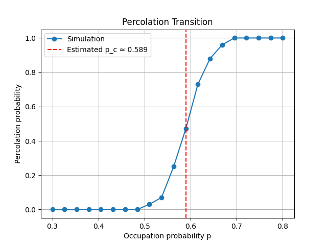

# Monte Carlo Simulation of 2D Site Percolation on a Square Lattice

## Overview

This project implements a **Monte Carlo simulation of site percolation on a 2D square lattice**. The goal is to study how connected clusters emerge as the site occupation probability increases and to estimate the **critical percolation threshold**.

In site percolation, each lattice site is occupied with probability (p). As (p) increases, clusters grow until a spanning cluster connects the **top and bottom boundaries** of the lattice.

For a square lattice, the theoretical threshold is:

p_c ≈ 0.5927

The simulation estimates this threshold numerically and compares the results with the theoretical prediction.

---

## Project Structure

percolation/
    lattice.py — random lattice generation
    cluster.py — BFS percolation detection
    simulation.py — Monte Carlo simulation
    visualization.py — plotting utilities

tests/
    test_lattice.py
    test_cluster.py
    test_simulation.py

main.py
requirements.txt
README.md

---

## Method

The simulation works as follows:

1. Generate a random lattice of size (L \times L), where each site is occupied with probability (p).
2. Use a **Breadth-First Search (BFS)** algorithm to detect whether a connected cluster spans from the top row to the bottom row.
3. Repeat the experiment for many Monte Carlo trials.
4. Compute the probability that the lattice percolates for each value of (p).
5. Estimate the critical threshold (p_c).

Simulations are performed for multiple lattice sizes to study **finite-size effects**.

---

## Results

### Percolation Transition

(Percolation probability vs occupation probability plot)

The probability of percolation increases sharply near the critical threshold.

---

### Finite-Size Comparison

(Plot showing results for multiple lattice sizes)

As lattice size increases, the transition becomes sharper and the estimated threshold approaches the theoretical value.

---

# Lattice Structure

---

## Running the Simulation

Install dependencies:

pip install -r requirements.txt

Run the simulation:

python main.py

This will perform the Monte Carlo simulation and generate the percolation plots.

---

## Testing

The project includes unit tests implemented using **pytest** to verify the correctness of the main components of the simulation.

The tests cover:

* **Lattice generation** — verifies that lattices are created correctly for different occupation probabilities.
* **Cluster detection** — ensures that the BFS algorithm correctly identifies percolating and non-percolating configurations.
* **Simulation behavior** — checks that the Monte Carlo simulation returns valid probability outputs.

These tests help ensure that the algorithms behave correctly and that edge cases (such as empty or fully occupied lattices) are handled properly.

Run all tests with:

pytest

---

## Dependencies

numpy
matplotlib
pytest

---

## Reproducibility

A fixed random seed is used to ensure reproducibility of the simulation:

np.random.seed(42)

---

## Summary

This project demonstrates how **Monte Carlo methods and graph traversal algorithms** can be used to study phase transitions in percolation systems. The simulation reproduces the expected behaviour and provides an estimate of the critical threshold close to the theoretical value.

